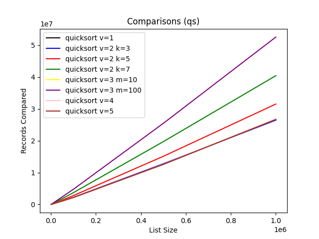
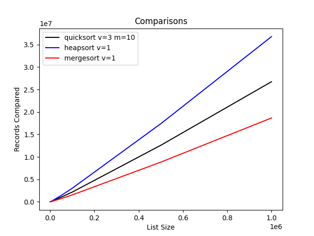
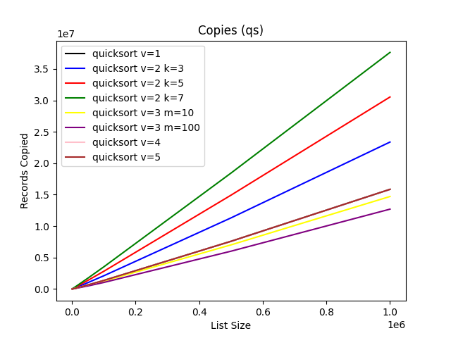
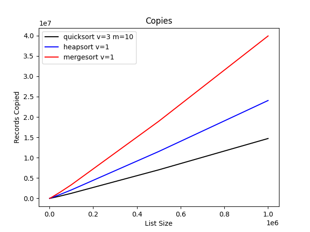
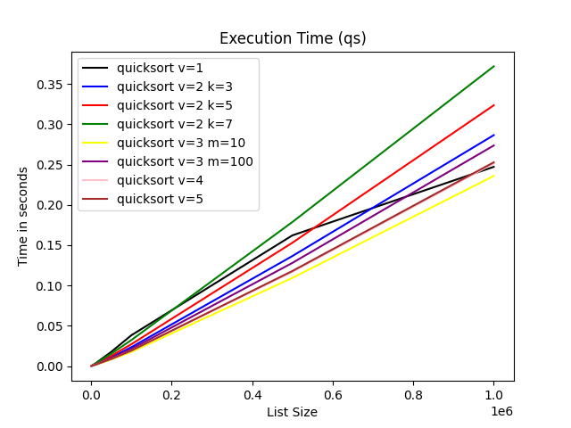
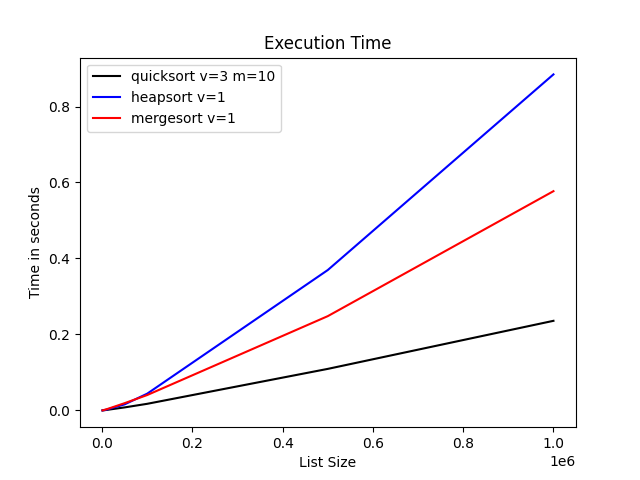

# Project - Sorting Algorithms

Sorting algorithms performance comparison.

## Objective

This work consists of analyzing the performance of different sorting algorithms 
in different scenarios, described below. This analysis consists of comparing 
the algorithms considering three performance metrics: number of key comparisons, 
the number of record copies performed, and the total time spent for sorting 
(processing time and not clock time). The inputs are sets of elements with 
randomly generated keys.

## Description

The performance of different variations of Quicksort should be compared for 
sorting a set of N records stored in a vector. These variations should also be 
compared with Heapsort and Mergesort. Each record contains: 

- An integer, which is the key for sorting
- Fifteen strings, each with 200 characters
- 10 real numbers


The Quicksort variations to be implemented and evaluated are:
- Recursive Quicksort.
- Median(k) Quicksort: this variation of Recursive Quicksort chooses the pivot for 
partition as the median of k randomly chosen elements of the vector.
- Selection(m) Quicksort: this variation modifies Recursive Quicksort to use the 
Selection algorithm to sort partitions with size less than or equal to m.
- Iterative Quicksort: this variation chooses the pivot as the middle element 
but is not recursive, using a stack to store partitions to be processed later.
- Smart Stack Quicksort: this variation of Iterative Quicksort processes the smallest partition first.

## Input

Each algorithm should be applied to random inputs with different sizes 
N = 1000, 5000, 10000, 50000, 100000, 500000 and 1000000. 
The average values of 5 runs should be counted.

## Complexity
Below is a theoretical comparison of the performance of these algorithms.


| Algorithm | Best Case | Average Case  | Worst Case| Extra Space | Stable? |
|--------------|------------|------------|------------|---------------|---------|
| **Heap Sort**  | O(n log n) | O(n log n) | O(n log n) | O(1) | Não |
| **Merge Sort** | O(n log n) | O(n log n) | O(n log n) | O(n) | Sim |
| **Quick Sort** | O(n log n) | O(n log n) | O(n²) | O(log n) | Não |

- Heap Sort
  - Uses a heap to organize the elements.
  - Has constant complexity O(n log n) in all cases.
  - Does not require extra space.
  - It's not stable and equal keys can be swapped.

- Merge sort
  - Uses the divide and conquer strategy.
  - Always guarantees complexity O(n log n).
  - Requests O(n) additional space when merging sublists.
  - It's stable.

- Quick sort
  - Chooses a pivot and partitions the array.
  - In the best and average case, it has O(n log n) complexity.
  - In the worst case, if a bad pivot is chosen, the complexity worsens to O(n²).
  - The additional space spent on recursion is on average O(log n). The iterative version eliminates this waste.
  - It's not stable.


## Data Visualization

Below are graphs showing the data obtained from the tests.
On the left side are the quick sort variations comparisons and on
the right side are the comparisons between the best quick sort variation 
and the other sorting algorithms described.


<p align="center">
    
    
</p>
<p align="center">
    
    
</p>
<p align="center">
    
    
</p>

Considering the metrics described, the best quick sort variation is that one which 
uses selection sort for short partitions. The tested partition size 10 is also 
better than the size 100. This variation is also better than the other algorithms.
better than the size 100

## Program Execution
- Compile the program.
```sh
make
```
- Execute test cases.
```sh
make alg
```
- Plot Graphs.
```sh
make plot
```
- Clean the project for another execution
```sh
make clean
```
