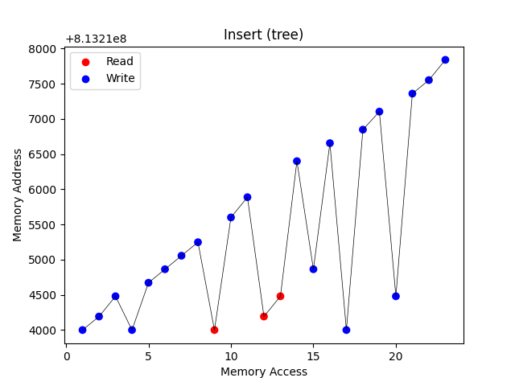
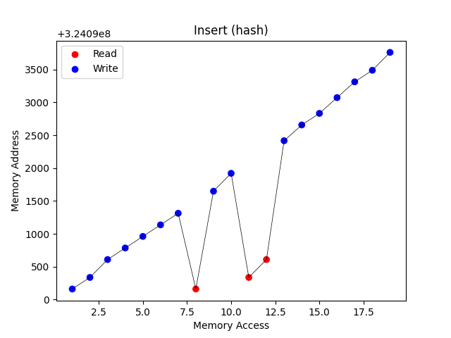
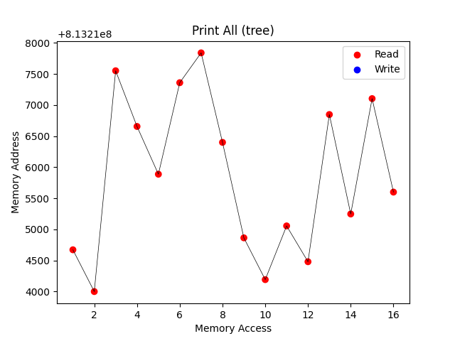
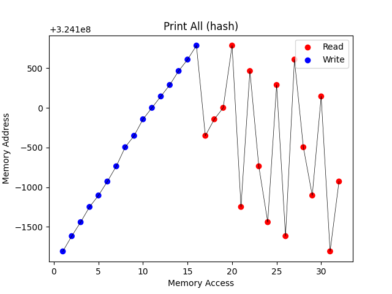
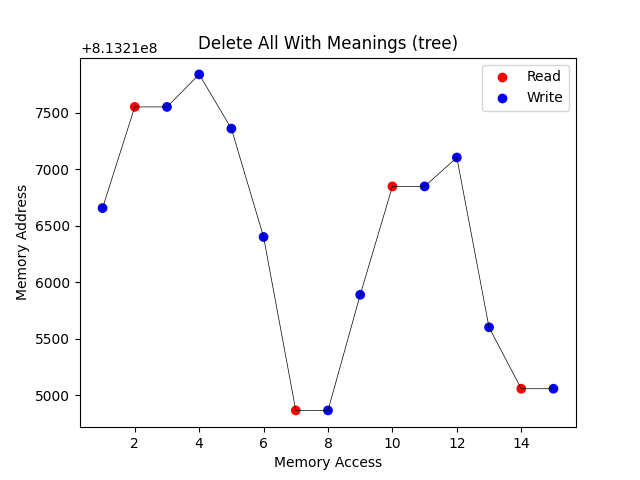
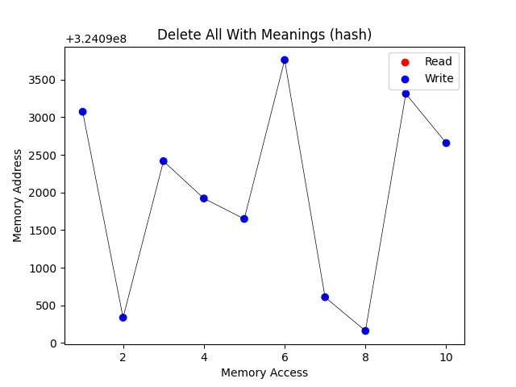

# Project 3 - Dictionary

## Objective

The objective of this work was to design, code, and evaluate different 
implementations of a word dictionary. A dictionary allows queries, 
insertions, deletions, ordered printing, and updating of an entry.

The goal was to compare two typical implementations: one based on a balanced 
search tree and another based on hashing with linked lists. 

## Input

The program input is a file containing words and its meanings. Each file line has the following
format:

a \[applied\] concerned with concrete problems or data

where:
a - indicates the type of the entry (adjective, noun or verb).
applied - is the word
concerned with concrete problems or data - is the meaning.

All those entries should be inserted in a dictionary.

## Output

The program should print all the dictionary entries in alfabetical order and meanings insert order as the
following example:

bad (a)
1. immoral, evil
2. below average in quality or performance, defective
3. spoiled, spoilt, capable of harming

Next, it should print in the same way, all the elements that have no meaning.

## Complexity

The following is the complexity of the main functions of each dictionary implementation.

| Operation          | AVL Tree             | Hash Table           |
|-------------------|----------------------|----------------------|
| **Insertion**      | O(log n)             | O(1) (average), O(n) (worst case) |
| **Deletion**       | O(log n)             | O(1) (average), O(n) (worst case) |
| **Query**         | O(log n)             | O(1) (average), O(n) (worst case) |
| **Print in Order** | O(n)                | O(n log n) (average), O(n²) (worst case)|

The tree structure ensure that the insetion, deletion and query operations have the complexity O(log n).
The balancing and update after delete operations uses pointers manipulation which have a constant complexity.
This structure is naturaly ordered so to print all n elements it's O(n).

The eficiency of the insertion, deletion and query operations in the Hash Table depends on the collision rate.
In the worst case all elements are mapped to the same index which costs O(n). Normaly it's just an array index acces which
cost O(1). The hash table is not naturaly ordered. All the elements must be copied to a list and be ordered. This operation 
complexity is limited by the quick sort complexity both for normal and worst cases.

## Memory Access
 With the output files of the execution it's possible to plot the following graphs:

<p align="center">
    
    
</p>
<p align="center">
    
    
</p>
<p align="center">
    
    
</p>

It's possible to see that the hash table is better in terms of memory access as it's almost linear 
if the collisions are not considered. The tree does a lot more jumps when the balance function is called.
Both structures needs to go to a far address when an already inserted word appears.

The tree shows a better printing function. When sorted the hash list shows a similar behavior other than the 
extra cost to copy the original list.

The hash is better at the deletion function as the tree spend an access to copy the value from one
node to another in the case of delete node have 2 child.


## Process Usage

The following graph shows the comparison between the proccess usage time. The values shown are 
mean of 6 executions.

[

The tree implementation was a little bit more faster.

## Conlusion
Both implementations are adequate for this propsed task. In the situation that the order of the
elements is important, the tree is better. But the constant balancing of the tree is offten worse 
than the possible collisions in the hash table, so it depends on the input format.

## How To Execute

- 1 Fist compile the program.
```sh
make
```
- 2 Execute the program and get the output files for both implementations.
```sh
make run
```
- 3 Execute the program and get memory access logs.
```sh
make memory
```
- 4 Execute the program and get process usage info.
```sh
make usage
```
- 5 Plot graphs.
```sh
make plot
```
- 6 Clean the project for another execution.
```sh
make clean
```
